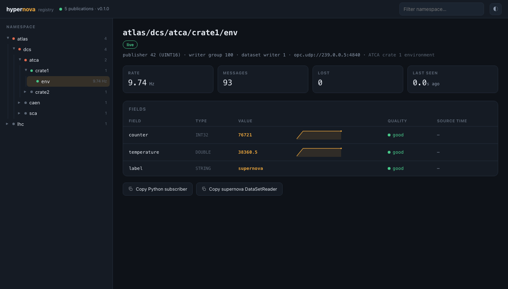

<h1 align="center">hypernova</h1>
<p align="center"><strong>DIP's proven shape, rebuilt on the industry standard</strong> — publish/subscribe<br>data interchange for control systems, on OPC UA Pub/Sub (Part 14).</p>

<p align="center">
  <a href="https://github.com/quasarnova-team/hypernova/actions/workflows/ci.yml"></a>
  <a href="https://github.com/quasarnova-team/hypernova/releases/latest"></a>
  <a href="LICENSE"></a>
  
  
</p>

---

> **Status: first release — v0.1.0, early.** Every claim below links to its
> evidence; hardening continues in the open.

hypernova is inspired by the shape that CERN's DIP proved at scale: named
publications, a name server, subscribe by name, values with quality and
timestamp. **It keeps that shape and replaces the substance with the industry
standard.** Publications are OPC UA Part 14 datasets over UDP, readable by
any Part 14 implementation, and every
[quasar](https://github.com/quasar-team/quasar)/[supernova](https://github.com/quasarnova-team/supernova)
OPC UA server is already a native publisher with five lines of config.

<p align="center"></p>
<p align="center"><em>The registry browser — DIP's browser, remade: a live namespace tree (with per-branch rollup state)
and an instrument pane for the selected stream — values, quality, rate, and a per-field sparkline,
fed by a real supernova C++ server at 10 Hz (synthetic demo namespaces). Deep-linkable, dark/light, zero dependencies.</em></p>

## Five lines, either direction

```python
from hypernova import Subscriber

with Subscriber("site/area1/pump7/env") as sub:
    for update in sub.updates():
        t = update.values["temperature"]
        print(t.value, "good" if t.is_good else hex(t.status), t.source_datetime)
```

```python
from hypernova import Publisher

with Publisher("site/area1/demo/env",
               fields={"temperature": "DOUBLE", "counts": "INT32[]"},
               address="opc.udp://239.10.0.1:14840",
               publisher_id=42, writer_group_id=100, dataset_writer_id=1) as pub:
    pub.send(temperature=21.5, counts=[1, 2, 3])
```

The same, from **Java** ([clients/java](clients/java) — dependency-free, JDK 11+):

```java
try (Subscriber sub = Subscriber.byName("http://registry:4850",
                                        "site/area1/pump7/env", null)) {
    Subscriber.Update update = sub.take(5000);
    System.out.println(update.values.get("temperature").value);
}
```

And a supernova C++ server publishes with **no code at all** — a `<PubSub>`
element in its config.xml
([documentation](https://github.com/quasarnova-team/supernova/blob/master/Documentation/source/PubSub.rst)).

## The pieces

| | |
|---|---|
| `hypernova registry` | The phonebook that listens: lookups, collision refusal, leases, per-network endpoints, primary/secondary failover, Prometheus `/metrics` — and the **live namespace browser** above (tree navigation, per-field sparklines, quality, copy-paste subscribers). Advisory by design: data flows without it. |
| `hypernova` / Java client | Publish & subscribe by name; per-field OPC UA status + source timestamp; scalars and arrays; coordinate caching (registry-down resilient). |
| `hypernova relay` | The firewall exception as a process: joins streams on one network, re-emits to explicit targets on another. One auditable config per boundary — and it can **sign at the boundary** (below). |
| `hypernova bridge-opcua` | Serves publications as a classic OPC UA server, so any OPC UA client — including commercial SCADA tools — can consume streams without Part 14 support. |
| `hypernova bridge-dip` | The migration path: republish existing DIP publications as hypernova streams; consumers move one at a time, publishers untouched. |
| `hypernova sub/pub/browse/register` | The CLI for humans and scripts. |

## Signed where it matters

Frames carry an optional Part 14 SecurityHeader with an HMAC-SHA256
signature — sign at the **publisher**, at the **boundary relay** (unsigned
inside the trusted network, signed the moment it leaves), verify at any
subscriber (Python or Java). Every bit of a signed frame is authenticated;
a subscriber with a key rejects unsigned frames outright. Details and honest
limits: [doc/security.md](doc/security.md).

## Proven, not promised

- **Byte-identical codecs across three languages**: the Python and Java
  encoders reproduce, bit for bit, golden vectors generated by supernova's
  C++ engine — and live interop runs against real C++ servers on **both**
  quasar backends, both directions, including arrays round-tripping
  *through* a C++ server's address space ([interop/](interop/)).
- **DIP scale**: 55,000 publications register in 0.33 s; name and stream
  lookups answer in under a microsecond; the store persists and reloads in
  half a second ([tests/test_scale_and_ops.py](tests/test_scale_and_ops.py)).
- **Soaked**: multi-publisher signed+unsigned soak across the 16-bit
  sequence wrap with zero loss, flat memory and flat file descriptors
  ([tests/soak/](tests/soak/), results in [QUALITY.md](QUALITY.md)).
- **Internally adversarially reviewed, twice** — every finding fixed and
  regression-locked ([QUALITY.md](QUALITY.md)).
- The full two-network DIP-replacement topology — C++ field server,
  registry, relay pinhole, remote consumer — runs self-verified with one
  command: [`demo/run_demo.sh`](demo/).

## Get started

```bash
pip install "hypernova[bridge] @ git+https://github.com/quasarnova-team/hypernova"
# (PyPI's "hypernova" is an unrelated package — install from git)
```

Ten-minute tour: [doc/quickstart.md](doc/quickstart.md) · API:
[doc/api.md](doc/api.md) · deploying across real network boundaries (+
systemd units in [deploy/](deploy/)): [doc/deployment.md](doc/deployment.md)

## Heritage

hypernova's publish/subscribe shape is inspired by DIP, the Data Interchange
Protocol developed at CERN, where it has interconnected control systems for two
decades. quasarnova is an independent project and is not affiliated with or
endorsed by CERN; hypernova shares no code with DIP — the wire format is
standard OPC UA Pub/Sub (Part 14).

## Reading

- [VISION.md](VISION.md) — the vision: where this is going
- [ARCHITECTURE.md](ARCHITECTURE.md) — components, flows, failure model
- [DIP-PARITY.md](DIP-PARITY.md) — the zero-gap matrix against DIP
- [doc/security.md](doc/security.md) — the signing profile and its limits
- [QUALITY.md](QUALITY.md) — the scored quality record

Part of the [quasarnova](https://github.com/quasarnova-team) family
(supernova: the C++ engine · kilonova: pure-Python servers · hypernova: the
interchange fabric). License: BSD-2-Clause.
