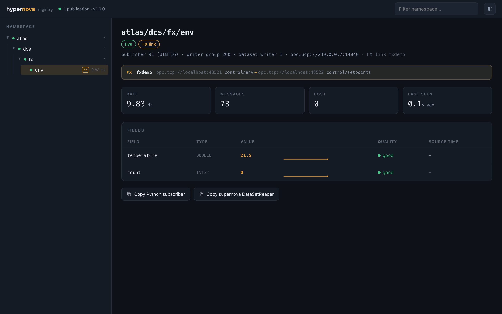

# OPC UA FX — wire two servers together

Static Pub/Sub decides *in each server's config* what flows where. **FX (Field
eXchange)** moves that decision to runtime: an FX-capable
[supernova](https://github.com/quasarnova-team/supernova) server describes
itself as an *automation component* whose *functional entities* offer named,
preconfigured input/output *datasets*, and exposes `EstablishConnections` /
`CloseConnections` methods. Any OPC UA client that calls them is an FX
*connection manager*. **hypernova is the nicest one** — you wire by name, one
command, with live status and a clean undo, and the process data then flows
directly server-to-server over the same Part 14 Pub/Sub wire hypernova already
speaks. hypernova carries none of the data; it is only the control plane.

This is the same identity as the rest of hypernova — names over coordinates,
discoverability, one-command simplicity, errors that teach — pointed at the FX
control plane. Requires the `[fx]` extra (asyncua), imported lazily like the
OPC UA bridge.

```bash
pip install "hypernova[fx] @ git+https://github.com/quasarnova-team/hypernova"
```

## The four moves

### See what a server offers

```bash
hypernova fx describe opc.tcp://server-a:4841
```

```
ProcessCell  (ns=2;s=ProcessCell)
  entity control
    output  env              temperature, count
    input   setpoints        setpoint, command
    connection (none)
```

The self-description is browsed live out of the server's address space — the
entities, their output (publishable) and input (receivable) datasets, and any
connections it currently holds. An engineering tool can offer exactly the legal
wiring choices instead of asking for free-text coordinates.

### Wire a publisher into a subscriber

```bash
hypernova fx link opc.tcp://server-a:4841 control/env \
                  opc.tcp://server-b:4841 control/setpoints \
                  --address opc.udp://239.0.0.7:14840 --wait
```

```
linked opc.tcp://server-a:4841 control/env  ->  opc.tcp://server-b:4841 control/setpoints
  connection: env-to-setpoints
  publisher  Operational
  subscriber Operational
  undo: hypernova fx unlink env-to-setpoints opc.tcp://server-a:4841 opc.tcp://server-b:4841
```

One command establishes the **publisher** side on A (which returns its wire
coordinates), then hands those coordinates to the **subscriber** side on B as
its `peer`. From that moment A publishes and the value lands in B's address
space, at its canonical cache-variable address, through the normal write path.
`--wait` blocks until both endpoints report Operational (a subscriber becomes
Operational on its first received datagram).

`--address` is where the publisher sends datagrams. For a **multicast group**
that is all you need — the subscriber binds the same group. For **unicast**
(the docker-safe choice, and any case without multicast between the servers)
give the subscriber's reachable address as `--address` and add
`--listen-address opc.udp://0.0.0.0:14840`.

### See the state of connections

```bash
hypernova fx status opc.tcp://server-a:4841 opc.tcp://server-b:4841
```

```
opc.tcp://server-a:4841
  env-to-setpoints  Operational     publisher:control.env  opc.udp://239.0.0.7:14840
opc.tcp://server-b:4841
  env-to-setpoints  Operational     subscriber:control.setpoints  opc.udp://239.0.0.7:14840
```

Status is read live from each server's `ConnectionEndpoints`, never from a
cache hypernova keeps — see [the registry decision](#fx-links-and-the-registry).
The states are the Part 81 `ConnectionEndpointStatusEnum`: `Initial` (0),
`PreOperational` (2, subscribing but no data yet), `Operational` (3), `Error`
(4).

### Undo, cleanly

```bash
hypernova fx unlink env-to-setpoints opc.tcp://server-a:4841 opc.tcp://server-b:4841
```

Closes the connection on both sides and returns both endpoints to `Initial`.
`unlink` is idempotent: a side that is already closed is not an error, so the
same command is safe to run twice or after a partial failure.

## Exit codes (for scripts)

The `fx` verbs use distinct exit codes so a script can tell a real error from a
qualified success:

| Code | Meaning |
|---|---|
| `0` | success |
| `1` | error (bad usage, unreachable server on a single-target command, an FX refusal) |
| `3` | `link` established but not Operational within `--wait --timeout` |
| `4` | `link` established but `--register` could not name it in the registry |
| `5` | a multi-server `status`/`unlink` sweep had at least one failing server |
| `130` | interrupted (SIGINT) |

For `link`, exit codes report the *link*, which is always live and undoable by
the time they are set — the printed `undo:` line works regardless. When both a
`--wait` timeout **and** a `--register` failure happen in one command, the exit
code is `3` (operational state outranks naming); the registry failure is still
printed to stderr.

## The same in Python

```python
import asyncio
from hypernova import fx

async def main():
    async with fx.connect("opc.tcp://server-a:4841") as a, \
               fx.connect("opc.tcp://server-b:4841") as b:
        print(await a.describe())                       # what does A offer?

        link = await fx.link(a.publisher("control", "env"),
                             b.subscriber("control", "setpoints"),
                             address="opc.udp://239.0.0.7:14840")
        await link.wait_operational(timeout=10)
        print(await link.status())                      # {'publisher': Endpoint(Operational), ...}

        await fx.unlink(link)                            # clean undo, both sides

asyncio.run(main())
```

`fx.connect(url)` is an async context manager over one server; `describe()`
returns a live `Component`. `server.publisher(entity, dataset)` and
`server.subscriber(entity, dataset)` name the two ends; `fx.link(...)` wires
them and returns a `Link` whose `status()` / `is_operational()` /
`wait_operational()` read both servers on demand. `fx.unlink(link)` closes both.

The low-level `server.establish(...)` / `server.close_connection(...)` are there
if you want one side at a time, but `link` / `unlink` are the safe pair.

## Safe by construction

**Pre-validation before any state change.** `link` first reads both servers'
self-descriptions and checks the entity, dataset and direction locally. A wrong
name fails *before* a single method is called, and names the legal options:

```
entity 'control' has no output dataset 'env2' to publish from;
available output datasets: env
```

**Atomic wiring with rollback.** If the publisher side establishes but the
subscriber side fails — however it fails: a refusal, a dropped connection, a
timeout, even a cancellation of the call — `link` rolls the publisher back (it
closes it), so a failed wiring never leaves a half-open connection publishing
into the void:

```
subscriber side failed on opc.tcp://server-b:4841 (... refused ...);
rolled the publisher side back on opc.tcp://server-a:4841 to avoid a half-open link
```

**Errors carry the server's own words.** A refused call comes back as
`Bad_InvalidArgument` with the reason in its `detail`; hypernova surfaces that
diagnostic verbatim (`FxRefused.diagnostic`) rather than a generic status —
"functional entity 'control' has no output dataset 'nope'", "JSON error at byte
1: …". Every failure a user can plausibly cause names the fix.

## FX links and the registry

> **Design decision: FX connection state is server-owned. hypernova does not
> store FX connections in its registry.**

hypernova's registry is *advisory* — its founding principle is that data flows
whether or not the registry is up. An FX connection is a control-plane action
plus a server-to-server data plane; its authoritative, live state already
exists in a canonical place: each server's `ConnectionEndpoints` folder, with a
`Status` variable the server itself maintains. Putting a second copy in the
hypernova registry would create exactly the drift the registry is built to
avoid — a server restarts, a connection drops, another manager rewires, and the
registry's copy is now a lie. So hypernova **reads FX state live from the
servers** (`fx status`, `Link.status()`); it never becomes a competing source
of truth, and it holds no state a crash could strand. A manager that dies
mid-life leaves the link running (server-owned) and any hypernova instance can
re-observe or close it — the same promise FX itself makes ("no manager in the
data path"), kept on the control plane too.

What hypernova's registry *is* still good for here is its one gift: **names**.
The stream an FX publisher produces is an ordinary Part 14 publication, so it
can be named in the registry and thereby browsed, sparklined and subscribed by
name like anything else — **opt-in**, because it is a separate concern from the
connection's existence:

```bash
hypernova fx link ... --address opc.udp://239.0.0.7:14840 --register cell7/env
```

`--register` registers the created stream (its coordinates come from the
publisher's establish; its field types are read from the source cache
variables — a type that cannot be read is refused with a teaching message
pointing at `hypernova register`, never guessed, since a wrong type would
misdecode the UADP) so it appears in the browser next to static publications
and is `hypernova sub cell7/env`-able. This names the
*data-plane stream*, not the *connection* — the connection stays server-owned.
It is meant for multicast/commissioned flows the registry can actually listen
to; registering a point-to-point unicast address only makes it discoverable by
name, not reachable by a third party.

The net relationship: **the FX-capable servers are the registry for FX
connections; hypernova's registry optionally names the streams those
connections create.** Connections live where they are true; names live where
names live.

### In the browser

Once registered, an FX-made stream is a first-class citizen of the registry
browser. It appears in the namespace tree with an **`FX`** tag, and its detail
view carries an **FX link** badge and a provenance bar naming the connection and
both ends — *publisher server · entity/dataset → subscriber server ·
entity/dataset*:

<p align="center"></p>

For a **multicast** link the registry joins the group and shows the stream
exactly like any native publication — live values, rate, freshness, quality and
per-field sparklines (above: one `fx link --register` command, then the stream
is live at ~10 Hz, marked FX, with full provenance). For a **unicast** link the
registry can't join the point-to-point flow, so the stream is stored and
browsable by name but shows *stale* — the detail view says so plainly and points
at `hypernova fx status`, so an operator reads "wired, but I can't hear it here"
rather than "broken." One command reproduces the live proof:
[`interop/run_fx_browser.sh`](../interop/run_fx_browser.sh).

## Honest limits

These mirror supernova's FX limits — hypernova is a faithful client of that
contract, not more:

- **JSON projection, not the FX binary DataTypes.** The connection methods take
  supernova's documented one-String JSON argument. hypernova speaks exactly
  that; it does not (yet) drive third-party FX managers that expect the binary
  `ConnectionConfiguration` structures.
- **No FX-specific access control.** The methods are callable by any client the
  server's endpoint admits, and the data plane is plain UADP. Use FX on trusted
  networks, exactly as supernova states.
- **`--register` needs readable source types.** Field wire types are read from
  the source cache variables; if one cannot be read, `--register` is refused
  with a message pointing at `hypernova register` (it never guesses a type). It
  names a stream for discovery; it does not deep-validate the schema.
- **A dataset connects once per direction.** Close the live connection before
  re-wiring the same dataset elsewhere — the server enforces this and hypernova
  surfaces its refusal.
- **IPv4 only**, as elsewhere in hypernova.

## Proven

- Offline: a fake transport mirrors a live FX server (its address space, its
  establish/close state machine and its exact refusal diagnostics), so
  describe, wire, rollback, status, undo and every teaching error are unit-tested
  without a server ([tests/test_fx.py](https://github.com/quasarnova-team/hypernova/blob/master/tests/test_fx.py)).
- Live: the full loop — describe → link → Operational → the value lands in the
  subscriber's address space → unlink → Initial → name reuse — runs against two
  real supernova FX servers as docker cells, driven through the
  `hypernova.fx` API, in both a same-backend and a cross-backend pairing
  ([interop/run_fx.sh](https://github.com/quasarnova-team/hypernova/blob/master/interop/run_fx.sh)).
